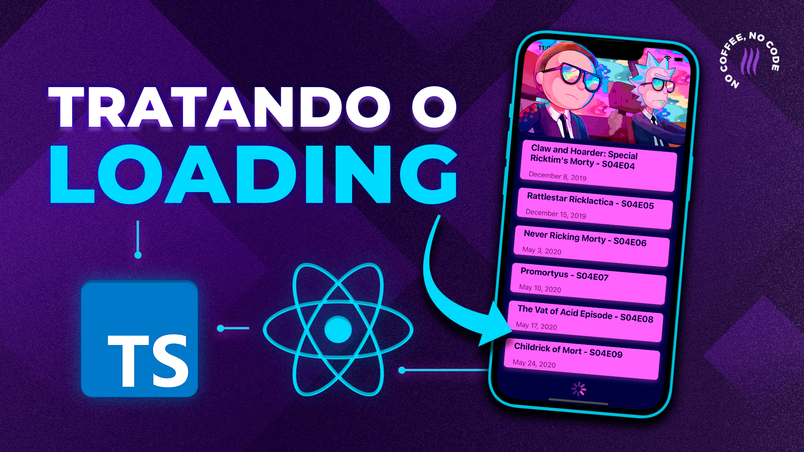

<h2>  Scroll Infinito no React Native com Flatlist e API REST </h2>

<h4> Aprenda a fazer a famosa lista infinita no React Native. Uma vez que o usuário faz o gesto de scroll e chega perto do final da lista, o App automaticamente faz uma chamada a API para buscar mais dados e exibir mais conteúdo para o usuário.  </h4>

 

### O que você encontrar aqui?

- Consumo de uma API real: [The Rick and Morty API](https://rickandmortyapi.com/)
- Projeto todo feito com TypeScript
- Tratamento do estado de Loading (UI e chamadas a API)
- Tratamento de estado de parada, quando API não possui mais dados.

 

#### Caso queira ver passo a passo esse scroll infinito foi feito, [acesse o tutorial em nosso canal no YouTube clicando aqui!](https://youtu.be/I3zD1ZVImrg)

 
